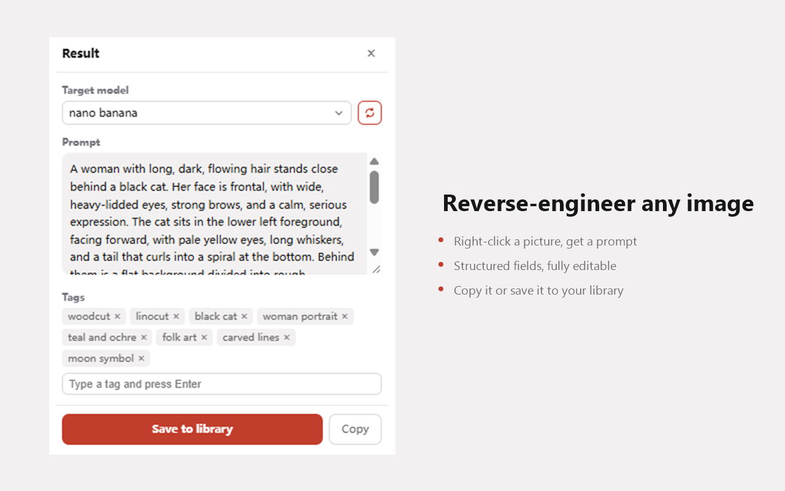
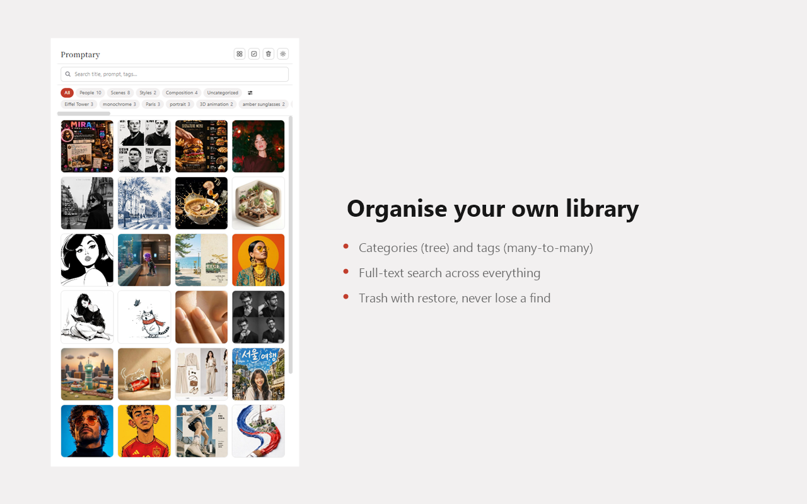
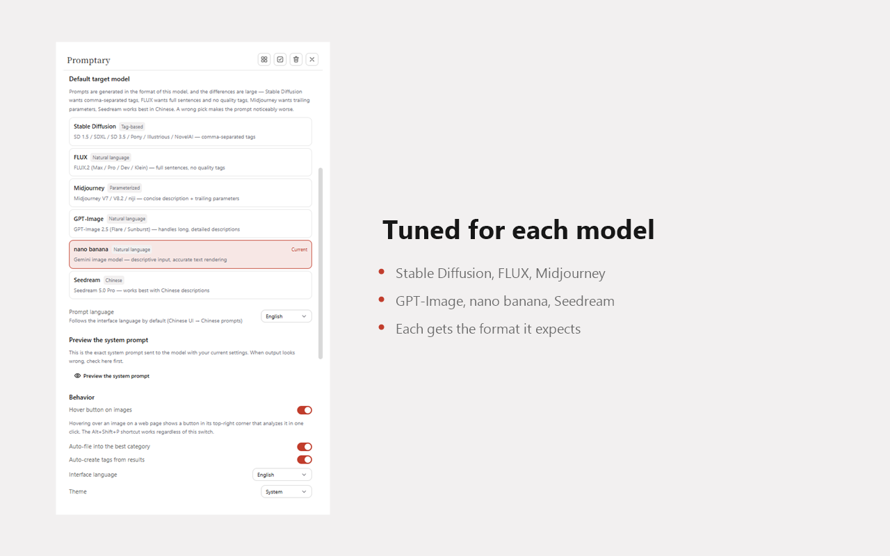
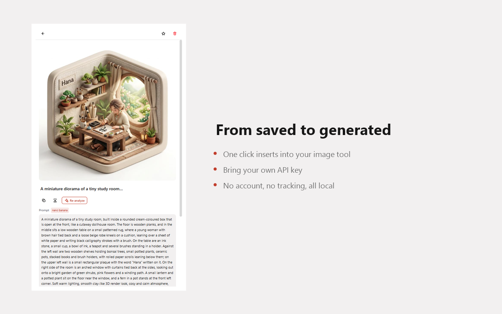

<div align="center">

# Promptary

**Right-click any image on the web. Get a prompt you can actually paste into your generator.**

[](./LICENSE)
[](https://developer.chrome.com/docs/extensions/develop/migrate)
[](./CONTRIBUTING.md)
[](#install)

[English](./README.md) · [简体中文](./README.zh-CN.md)



</div>

---

## Why this exists

Most "image to prompt" tools hand you a paragraph describing the picture. That is not a prompt — you still have to rewrite it before it is any use.

The hard part is that **the same image needs to be written differently for every model**:

| Model | What it actually wants |
| --- | --- |
| Stable Diffusion | comma-separated tags, weights, quality words, a negative prompt |
| FLUX | full sentences — and adding `masterpiece` actively hurts |
| Midjourney | a concise description with `--ar` / `--style` / `--v` appended |
| GPT-Image | long, detailed paragraphs |
| nano banana | natural descriptive language |
| Seedream | Chinese, which is what it handles best |

A tool that ignores this produces prompts that are **half wrong by construction** — the user still has to rewrite them, which defeats the point.

Promptary generates the prompt in the format of the model you picked. Choose once, and everything that comes out is ready to paste.

## Features

**Reverse-engineer from anywhere**
Right-click any image on any site. Or hover an image for a one-click button. Or press <kbd>Alt</kbd>+<kbd>Shift</kbd>+<kbd>P</kbd> to analyse whatever is under your cursor.

**Prompts in your model's dialect**
Six model profiles, each with its own rules and worked example. See [the table above](#why-this-exists) — switching model changes the output format, not just the wording.

**A library that stays usable**
Categories (a tree) and tags (many-to-many) for organisation. Full-text search across titles, prompts, tags and notes. Trash with restore. Import and export everything.

**Send it straight to your generator**
One click inserts the saved prompt into your image tool's input box. No copy-pasting.

**Works offline, in five languages**
English, 简体中文, 繁體中文, 日本語, 한국어.

## Screenshots

**Your library** — categories and tags on the left, thumbnail grid on the right. Hover a card for star and delete.



**Model profiles** — pick your target model once. Each profile carries its own rules, so switching changes the output format, not just the wording.



**Item detail** — edit the prompt, prune the tags, switch models and re-analyse. One click sends it to your generator.



## Privacy

No account. No sign-up. No analytics. No telemetry. **There is no Promptary server.**

- Your images, prompts and tags live in your browser's local database and are never uploaded to us.
- Your API key is stored separately from your library and is deliberately excluded from exported backups.
- The only network request the extension ever makes is the one you trigger: sending an image to the AI model service **you** configured.

Read the full policy: [English](./docs/PRIVACY.md) · [简体中文](./docs/PRIVACY.zh-CN.md)

## Install

**Chrome Web Store** — coming soon.

**From source** (works today):

```bash
git clone https://github.com/dingge001/promptary.git
cd promptary
pnpm install
pnpm build
```

Then open `chrome://extensions`, enable **Developer mode**, click **Load unpacked**, and select `.output/chrome-mv3`.

## Setup

Promptary needs a model that accepts image input. It speaks the OpenAI-compatible API, so anything that does works — DeepSeek, OpenAI, OpenRouter, SiliconFlow, or a service you host yourself.

1. Click the toolbar icon to open the side panel
2. Go to **Settings** and fill in the endpoint, API key and model name
3. Hit **Test connection**

You can preview exactly what gets sent to the model under **Settings → Preview the system prompt**. When output looks wrong, check there first — it is the real text, not a description of it.

## Usage

| Action | How |
| --- | --- |
| Reverse-engineer an image | Right-click it → **Reverse-engineer this image** |
| Save an image without analysing | Right-click it → **Save this image** |
| Save a piece of text | Select it → right-click → **Save selected text as a prompt** |
| Pick from all images on a page | Toolbar → grid icon |
| Re-analyse an existing item with another model | Open it → pick a model → **Re-analyze** |
| Send a prompt to your generator | Open an item → inject icon |

## Development

```bash
pnpm dev        # launches a browser with the extension loaded, hot-reloading
pnpm compile    # type check
pnpm build      # outputs to .output/chrome-mv3
pnpm zip        # packaged zip for the Web Store
```

After changing `entrypoints/content.ts` or `background.ts`, reload the extension **and refresh the target page** — content scripts are injected at page load.

### Project layout

```
entrypoints/
  background.ts        right-click menus, model calls, image fetching
  content.ts           page DOM: image collection, prompt injection, in-page UI
  sidepanel/           the main interface
lib/
  db/                  Dexie data layer (UUID keys, soft deletes, sync-ready fields)
  providers/           model access, OpenAI-compatible
  vision/              models.ts  ← the model profiles (the core asset)
                       schema.ts  ← assembles the system prompt
  i18n/                five locales, typed so a missing key fails the build
```

## Contributing

The most valuable contribution is also the easiest: **adding a model profile**. It means appending one entry to the array in `lib/vision/models.ts` — no logic changes required.

See [CONTRIBUTING.md](./CONTRIBUTING.md) for how to write good `rules`, and why the worked `example` matters more than the rules do.

## License

[MIT](./LICENSE)
